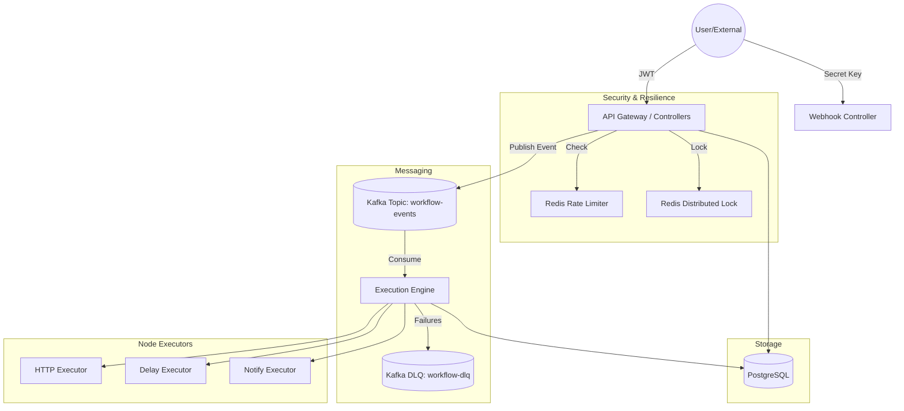
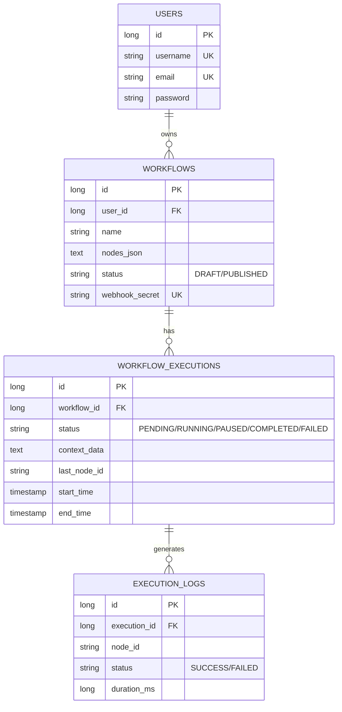
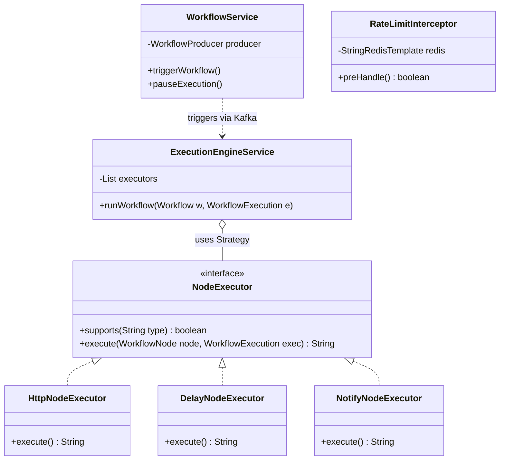

# 🌊 Flow | Production-Grade Workflow Orchestrator

Flow is a distributed, resilient, and scalable workflow orchestration engine built with **Spring Boot**, **Kafka**, **Redis**, and **PostgreSQL**. It allows users to define complex sequences of tasks (Nodes) and execute them asynchronously with high reliability.

---

## 🏗️ High-Level Design (HLD)

The system is designed with a **Separation of Concerns** between the API layer and the Execution Engine, using Kafka as the backbone for scalability.



### Key Components:
- **API Layer**: Handles workflow CRUD, authentication, and manual triggers.
- **Kafka Backbone**: Decouples API requests from heavy execution, allowing for massive horizontal scaling.
- **Redis Interceptor**: Provides sliding-window rate limiting (10 req/min) to prevent abuse.
- **Execution Engine**: A state machine that iterates through nodes, handles retries with exponential backoff, and routes persistent failures to the **Dead Letter Queue (DLQ)**.
- **Distributed Locking**: Uses Redis `SET NX` to ensure a single workflow execution is never processed by multiple engine instances simultaneously.

---

## 📊 Database Design (ERD)

We use a relational schema to maintain strict data integrity across workflows and their execution history.



---

## 🛠️ Low-Level Design (LLD)

### 🧩 Design Patterns Used:
1.  **Strategy Pattern**: Used for the `NodeExecutor` interface. This allows us to add new node types (like Slack, Email, or Python Script) by simply creating a new class without modifying the core engine logic.
2.  **Interceptor Pattern**: The `RateLimitInterceptor` intercepts incoming HTTP requests before they reach the controllers, providing a clean way to manage global cross-cutting concerns like rate limiting.
3.  **State Machine**: The `ExecutionEngineService` acts as a state machine, maintaining the context and iterating through the workflow graph based on node outputs.
4.  **Producer-Consumer**: Decouples API triggers from execution using Kafka topics.

### 📐 Class Diagram



---

## 🔌 API Contracts

### 🔐 Authentication
| Endpoint | Method | Description |
| :--- | :--- | :--- |
| `/api/auth/register` | `POST` | Create a new user account |
| `/api/auth/login` | `POST` | Get JWT token for API access |

### 📝 Workflow Management
| Endpoint | Method | Auth | Description |
| :--- | :--- | :--- | :--- |
| `/api/workflows` | `POST` | JWT | Create a new workflow draft |
| `/api/workflows` | `GET` | JWT | List all workflows for current user |
| `/api/workflows/{id}/nodes` | `PUT` | JWT | Update node configuration (JSON) |
| `/api/workflows/{id}/publish` | `POST` | JWT | Set status to PUBLISHED |

### 🚀 Execution & Triggers
| Endpoint | Method | Auth | Description |
| :--- | :--- | :--- | :--- |
| `/api/workflows/{id}/trigger` | `POST` | JWT | Manually trigger a workflow run |
| `/api/webhooks/{id}` | `POST` | Secret | Public trigger via `?secret=...` |
| `/api/workflows/{id}/executions`| `GET` | JWT | View chronological execution history |
| `/api/executions/{id}/pause` | `POST` | JWT | Pause a running execution |
| `/api/executions/{id}/resume` | `POST` | JWT | Resume a paused execution |

---


### 📽️ Scene 1: Project Overview & Tech Stack

### 1. Infrastructure Setup
Ensure Docker is running and start the stack:
```bash
docker-compose up -d
```

### 2. Application Start
Clear JVM conflicts and run the backend:
```powershell
$env:JAVA_TOOL_OPTIONS=''; $env:JAVA_HOME='C:\Program Files\Eclipse Adoptium\jdk-17.0.12.7-hotspot'; mvn spring-boot:run
```

---

## 🎥 Feature Demonstration
Check the https://screenrec.com/share/BoklIc4r1W to see the system in action, including:
- **Redis Rate Limiting**
- **Kafka Execution Logs**
- **Notify/Delay Node Logic**
- **Pause/Resume Mechanics**
